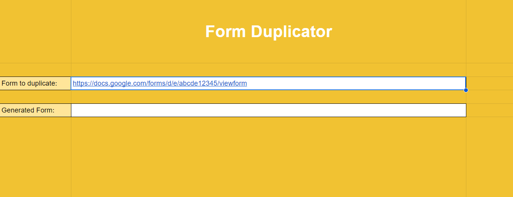

# FormDuplicator
FormDuplicator is a tool to duplicate a public Google Form without being an owner/collaborator of the form.

Spreadsheet with script:

https://docs.google.com/spreadsheets/d/1nYBfvTkIWfmBFhnaNFrDDQh5m_9GJ0m0xHPbqVQhfD4/copy

This tool can copy the following types of Form question:

- Short Answer
- Paragraph
- Multiple Choice
- Checkboxes
- Dropdown
- Linear Scale
- Panel
- Multiple choice grid
- Checkbox grid
- Section
- Date
- Time
- Image
- Video

File upload question type is not supported.

This tool only works with Google Forms that don't require a login access with a Google account.

# Usage

After making a copy of the spreadsheet, only the first time you need to grant access to run the script, by following these actions:
- Click "Extensions" in the spreadsheet toolbar
- Click "Apps Script"
- In the Editor page click the "Run" botton
- A pop-up for "Authorization required" will shwo up, click on "Review permissions"
- Select your Google Account
- In the "Google hasn’t verified this app" page click on "Advanced" in the bottom left, go to "FormDuplicator (unsafe)"
- Click on Allow
- After the script start running you can stop the execution and reload the Spreadsheet page

To run the tool you need to click on the "FormDuplicator" item in the toolbar and then "Duplicate Form".

After every executions the tool will display a pop-up in the spreadsheet with a message (correct duplication, partial duplication or errors). If the form to duplicate contains some elements that the script could not replicate, all the not duplicated settings/questions/properties will be printed in the sheet "Not duplicated".

## Worksheets

### Settings

Form to duplicate: The public form url you need to duplicate

Generated Form: After the script execution, it will display your duplicated form url (Editor page)

### Not duplicated

Some Form settings, question and question properties cannot be setted programmaticaly with Google Apps Script, because of the lack of methods / Object or due to open bugs.
If the script find some of these element, it will print every not duplicated settings of the form in this sheet.

Here is a list of things that cannot be duplicated from a Form with this tool:

#### Form settings

- Responses
  - Collect email addresses
    - Verified - method not present
      
  - Send responders a copy of their response
      - Always - method not present
      - When requested - method not present

- Presentation
  - Disable autosave for all respondents - method not present

#### Form Questions

In each question type it's impossible to set the text style (bold, italic ecc.) in the title and description for lack of methods. This tool doesn't support the duplication of image source in image question type, question description or question choices.

Short Answer

- Response Validation
  - Text
    - Contains - method not present (work-around using Regular Expression literals)
    - Doesn't contain - method not present (work-around using Regular Expression literals)
 
Multiple Choice / Checkboxes

- Shuffle Order Question - method not present

Multiple Choice

- Due to a bug, it's impossible to set the "Other" option if other choices in same question have "Go to section based on answer"
  See here: https://issuetracker.google.com/issues/171782147

DateTime
 - Due to a bug, using setIncludesYear() will create a Date question without the time.
   See here: https://issuetracker.google.com/issues/36763896

    
File Upload - Object not present

## Toolbar

The toolbar has the "FormDuplicator" item that when clicked will display this option:
- Duplicate Form: analyze the form specified in the Settings worksheet and create a copy of the form. At the end of the execution, if the script found some impossible to duplicate item, it will print them in the worksheet "Not duplicated"
